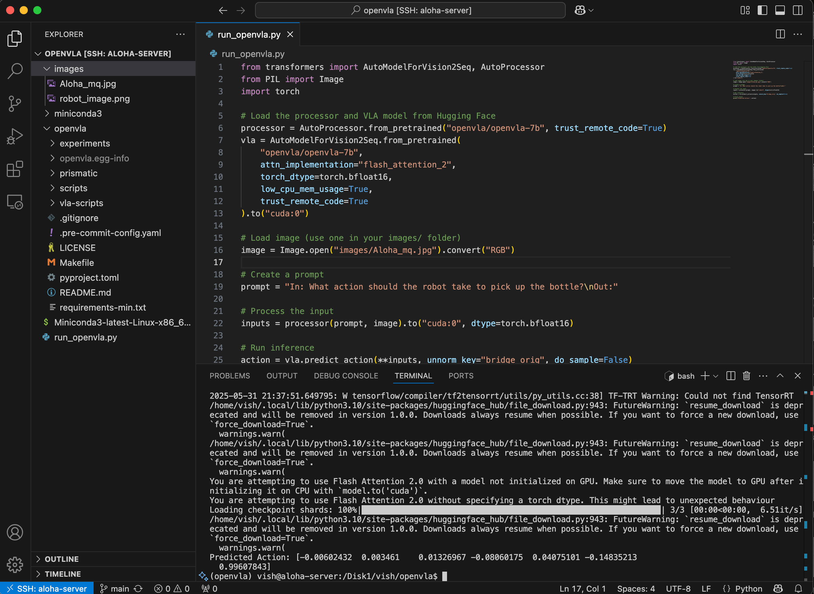

# OpenVLA on a Shared HPC Server: Deployment Notes

Case study from a 15-week research internship at Macquarie University's [Centre for Applied Artificial Intelligence (CAAI)](https://www.mq.edu.au/research/research-centres-groups-and-facilities/groups/centre-for-applied-artificial-intelligence), deploying Vision-Language-Action (VLA) models for the ALOHA bimanual robot.

The companion writeup is on Medium: **[Deploying OpenVLA-7B on a Shared HPC Server Without Sudo: Notes from a Failed Fine-Tune](https://medium.com/@vishesh062/deploying-openvla-7b-on-a-shared-hpc-server-without-sudo-notes-from-a-failed-fine-tune-40d6ba370657)**. Read that first if you only have ten minutes. This repo is the structured version with the model comparison, the architecture proposal, and the debugging trail broken out into separate docs.


*`run_openvla.py` and its output. A 7-dimensional action vector — six end-effector deltas and a gripper command, generated from an image and a natural-language instruction. About six weeks of infrastructure work for those seven numbers.*

## Status

This is a documentation repository, not a runnable codebase. The source code I wrote during the internship lived on the centre's GPU server and I don't have a copy. What's here:

- A comparative analysis across eight VLA models
- The hybrid TinyVLA + RoboMamba architecture I proposed
- The infrastructure debugging trail: cache redirection, FlashAttention symbol failures, MiniVLA patches
- Lessons that generalise to anyone trying to deploy a 7B model on a constrained shared server

The fine-tune didn't complete inside the internship window. I'm honest about that in `docs/07-lessons-learned.md`. The infrastructure work that got us to a launched training run is the substance.

## What we were trying to do

OpenVLA is a 7-billion-parameter Vision-Language-Action model. A `dinosiglip-224px` vision backbone feeds a Llama-2-7B language model, with action tokenisation on top. Give it an RGB image and an instruction like "pick up the red block," and it returns a sequence of action tokens that decode into robot end-effector commands.

The brief had three parts:

1. Get OpenVLA-7B running on the centre's dual-A100 server
2. Prepare a custom dataset of cleaned ALOHA teleop demonstrations (`aloha_clean_dish`)
3. Fine-tune the model on that dataset and compare against MiniVLA

Model weights were public. Codebase was open. Hardware was there. The interesting constraints were elsewhere.

## What I built and what I learned

| Phase | Output |
|---|---|
| Weeks 1–6: Research | Comparative analysis of 8 VLA models; hybrid TinyVLA + RoboMamba architecture proposal |
| Weeks 7–8: Local prototype | FastAPI server wrapping TinyVLA inference, wired to ROS 2; image → action token loop validated locally |
| Weeks 9–10: HPC migration | OpenVLA-7B loaded on dual-A100s; cache-redirection pattern for non-sudo HPC environments |
| Weeks 11–12: Fine-tune attempt | MiniVLA patches for Qwen 0.5B's non-standard hidden size; FlashAttention 2 build with symbol-resolution failures; training launched but not completed |

If you only take one thing from this repo, take the cache-redirection pattern in `snippets/cache-redirect.sh`. Five minutes of setup saves a week of partial downloads on a 95%-full root partition.

## Repository contents

```
.
├── README.md
├── docs/
│   ├── 01-project-overview.md             scope, organisation, team
│   ├── 02-vla-model-comparison.md         the 8-model comparative analysis
│   ├── 03-hybrid-pipeline-design.md       TinyVLA + RoboMamba proposal
│   ├── 04-environment-setup.md            cache redirection on a 95%-full root
│   ├── 05-flashattention-debug.md         the symbol-resolution saga
│   ├── 06-minivla-patches.md              base_llm.py and qwen25.py for Qwen 0.5B
│   ├── 07-lessons-learned.md              what generalises
│   └── 08-future-work.md                  open threads
├── snippets/
│   ├── cache-redirect.sh                  HF_HOME, TRANSFORMERS_CACHE, etc.
│   ├── flashattn-build.sh                 the TORCH_CUDA_ARCH_LIST invocation
│   └── load-openvla.py                    AutoProcessor / AutoModelForVision2Seq
├── diagrams/
│   └── hybrid-pipeline.png                the proposed architecture
└── screenshots/
    ├── 01-openvla-inference-source.png    run_openvla.py + 7-dim action vector
    ├── 02-openvla-7b-shards-loading.png   the 13.6 GB model load
    ├── 03-minivla-positional-embedding-resize.png  the (37,37)→(16,16) patch in action
    ├── 04-minivla-backbone-debugging.png  qwen_backbone.py debug session
    ├── 05-flashattention-warnings.png     the FA2 warning state
    └── 06-fastapi-real-image-request.png  the backend processing a real image
```

## Reading order

Ten minutes: the Medium post.

An hour, in order:

1. `02-vla-model-comparison.md` — the landscape, why OpenVLA was the right target
2. `04-environment-setup.md` — the cache redirection pattern, the single most reusable thing
3. `05-flashattention-debug.md` — where the project went sideways
4. `06-minivla-patches.md` — what broke when MiniVLA's Qwen 0.5B met OpenVLA's training scaffolding
5. `07-lessons-learned.md` — what generalises

## Acknowledgements

Supervised by [Yuankai Qi](https://yuankaiqi.github.io/) at Macquarie's CAAI. Project teammates: Prajwal Chaudhary and Md Rownak Islam Dip.

## About me

I'm looking for ML engineering and applied AI roles in Sydney. Find me on **[GitHub](https://github.com/Vishesh062)**, **[LinkedIn](https://linkedin.com/in/visheshsingh062)**, or **[Medium](https://medium.com/@vishesh062)**.

## License

Writeups in this repository are licensed under [CC BY 4.0](https://creativecommons.org/licenses/by/4.0/). Code snippets under MIT — see `LICENSE`.
