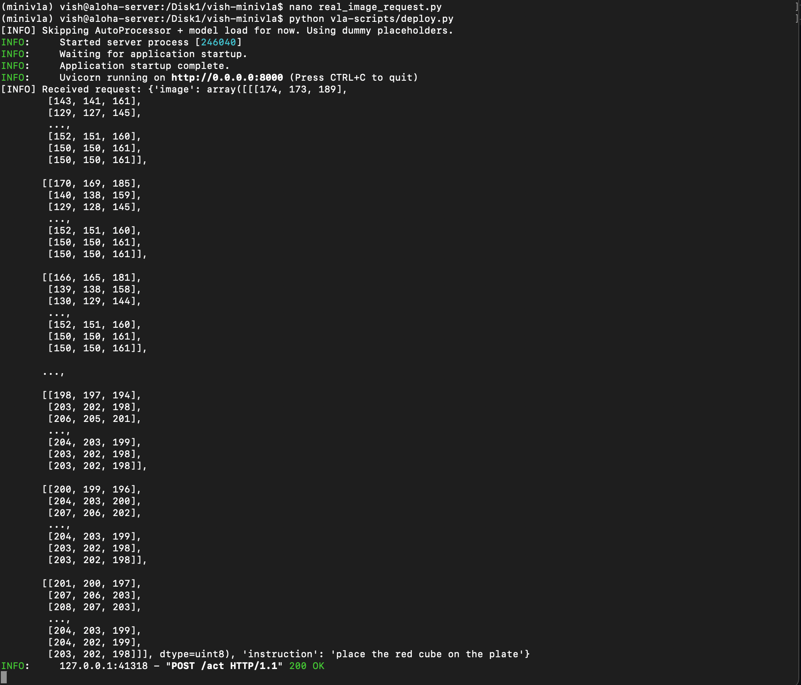

# 03 — Hybrid Pipeline Design: TinyVLA + RoboMamba

The most original technical contribution of the internship. A two-tier architecture combining a fast diffusion-policy model (TinyVLA) with a long-horizon state-space planner (RoboMamba), connected by ROS 2 middleware on the ALOHA platform.

## Why bother

After working through the comparison in `docs/02`, one pattern was hard to miss: no single VLA was good at both fast reactive action generation **and** long-horizon task planning.

- TinyVLA, CogACT: diffusion policy, smooth low-latency actions, but limited horizon. They predict a few action tokens ahead, not a multi-step plan.
- RoboMamba: state-space model, efficient long-context reasoning, but heavier per inference and not optimised for tight perception-action loops.
- OpenVLA, MiniVLA: token-based, good general performance, but neither solves the "what should I do next minute vs next 100 ms" gap cleanly.

ALOHA tasks like "pick up the dish, rinse it, place it on the drying rack" need both things. A monolithic 7B model can do them but pays a latency cost on every fast action. Decomposing the problem along the fast/slow axis is a more standard systems pattern, so that's what I proposed.

## The design

```
                    ┌──────────────────────────────┐
                    │  Camera input / observations │
                    └──────────────┬───────────────┘
                                   │
                    ┌──────────────▼───────────────┐
                    │     Visual encoder           │
                    │   (TinyVLA: CLIP / SigLIP)   │
                    └──────────┬─────────┬─────────┘
                               │         │
        ┌──────────────────────▼──┐   ┌──▼────────────────────────┐
        │ Fast action inference   │   │  Long-horizon planner     │
        │ (TinyVLA diffusion)     │   │  (RoboMamba SSM)          │
        │  ~10 Hz, short-horizon  │   │  ~1 Hz, multi-step goals  │
        └──────────┬──────────────┘   └──────────┬────────────────┘
                   │                             │
                   │   Trajectory adjustment     │
                   │ ◄───────────────────────────┘
                   │
        ┌──────────▼──────────────┐
        │  Final action commands  │
        └──────────┬──────────────┘
                   │
        ┌──────────▼──────────────┐
        │   Robot execution       │
        │   (ALOHA bimanual)      │
        └─────────────────────────┘
```

The original diagram is in `diagrams/hybrid-pipeline.png` (extracted from the final report).

## How the two tiers talk

The whole thing hangs on the two tiers running asynchronously through ROS 2:

- **TinyVLA** runs at a high rate (~10 Hz target). Consumes the visual stream, generates short-horizon action chunks, publishes them on `/actions/fast`.
- **RoboMamba** runs at a low rate (~1 Hz, or event-triggered). Consumes the visual stream plus task context, produces subgoals or trajectory adjustments, publishes them on `/plan/subgoals`.
- A lightweight coordinator node subscribes to both. Fast actions execute by default. Subgoal updates from the planner shift the fast policy's conditioning input. Final command goes out on `/cmd/action`.

ROS 2 fits well here because of its **QoS (Quality of Service) policies**. The fast topic wants low-latency best-effort delivery — drop a stale action rather than block. The planner topic wants reliable delivery but tolerates jitter. ROS 2 lets you configure those separately per topic. That's more painful in custom socket code.

## What got built

The proposal and the perception tier got built. The planner tier and the coordinator did not.


*The TinyVLA/MiniVLA FastAPI backend (`deploy.py`) running on `0.0.0.0:8000`, receiving a POST with a real image and the instruction "place the red cube on the plate," responding with 200 OK. This is the perception-side of the hybrid design working end-to-end. The RoboMamba planner tier on top of this was the unimplemented half.*

If I had another month, what I'd build next:

1. A skeleton RoboMamba node publishing dummy subgoals on a fixed schedule, just to validate the coordinator logic
2. The coordinator's blending policy (probably "fast policy by default, planner overrides on subgoal update")
3. Swap the dummy planner for the real RoboMamba inference once the coordinator is stable

## Why the design still holds up

Two reasons this proposal is worth documenting even though half of it didn't get built:

The fast/slow decomposition is a real architectural pattern in robotics. Model-predictive control over a learned policy, hierarchical RL, options frameworks — all the same shape. I didn't invent the pattern. What I did was pick two specific models that complement each other along it.

And ROS 2 as the integration substrate is the right call regardless of which models go in the boxes. Anyone picking this up later can swap TinyVLA for whatever the best small diffusion VLA is at the time, swap RoboMamba for whatever's good at long-context reasoning, and the wiring stays the same.

## See also

- `02-vla-model-comparison.md` — why these two models specifically
- `08-future-work.md` — what implementing the rest of this would look like
