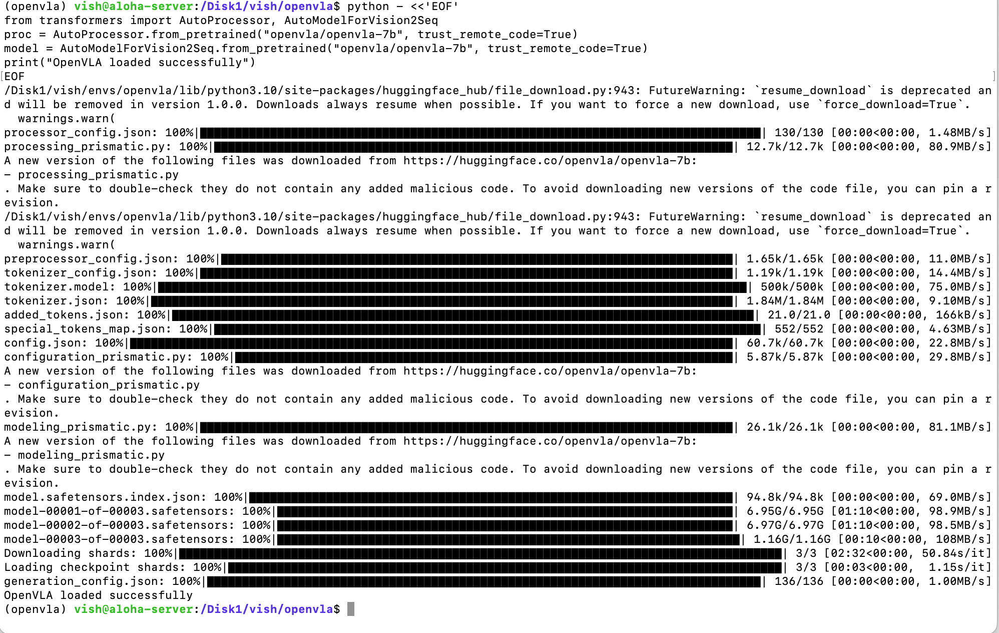

# 04 — Environment Setup on a Shared HPC Server

The single most reusable thing in this repo. If you're deploying a large model on a shared university server, on a partition that isn't yours, with PyTorch and CUDA already installed by someone else, do these things on day one and save yourself a week.

## The situation

`aloha-server`: dual NVIDIA A100s. Great.

The catch:

- No sudo. The root filesystem was managed by someone I never met. The system-wide PyTorch and CUDA weren't going to change.
- Root partition about 95% full on day one. Several other students had projects running. The default `/tmp`, `/home`, and `~/.cache` all lived on root.
- A secondary 1 TB volume `/Disk1` existed with plenty of space, but nothing was configured to use it by default.
- VPN + SSH access only. No GUI. Frequent disconnects.

PyTorch and CUDA versions on the system were both several minor releases behind what current OpenVLA wanted. That couldn't be fixed. Everything below worked around it.

## Problem: every Python ML tool writes to a different cache, and they all default to root

When you naively `pip install transformers` and load a 7B model, several caches start filling up in places you didn't ask:

- HuggingFace caches model weights to `~/.cache/huggingface/`
- `pip` caches wheels to `~/.cache/pip/`
- PyTorch tempfiles default to `/tmp/`
- Conda packages go to `~/miniconda3/pkgs/`

For OpenVLA-7B specifically: model weights are ~13.6 GB across three safetensors shards, before tokenizer files, processor configs, or the Prismatic codebase's auto-downloaded modules. All of that hits root by default.

On a 95%-full root partition this fails one of three ways. Download dies mid-shard with a write error. The partial cache won't resume. And once, the partition hit 100% and locked out other users for an afternoon.

## The fix: redirect every cache before the first install

Set these before you run any `pip` or `conda` command:

```bash
export HF_HOME=/Disk1/vish/hf_cache
export TRANSFORMERS_CACHE=/Disk1/vish/hf_cache  # deprecated but still respected
export PIP_CACHE_DIR=/Disk1/vish/pip_cache
export TMPDIR=/Disk1/vish/tmp
export CONDA_PKGS_DIRS=/Disk1/vish/conda_pkgs
```

Add to `~/.bashrc`, source it, then create the Conda environment directly under `/Disk1` so it doesn't end up in `~/miniconda3/envs/`:

```bash
conda create -p /Disk1/vish/envs/openvla python=3.10
conda activate /Disk1/vish/envs/openvla
```

Full script is at `snippets/cache-redirect.sh`. Takes about five minutes. Saved me roughly a week over the course of the project.

## Why each variable matters

| Variable | What it redirects | Why it's not optional |
|---|---|---|
| `HF_HOME` | Hugging Face model weights, tokenizers, processor configs | Where 13.6 GB of OpenVLA-7B lives |
| `TRANSFORMERS_CACHE` | Older name for the same thing | Deprecated but still read by some libraries; set both |
| `PIP_CACHE_DIR` | `pip` wheel cache | A single fresh install of `torch` is ~2 GB |
| `TMPDIR` | Python tempfile ops, build artifacts, partial downloads | Where HuggingFace actually writes during download before atomic-renaming into `HF_HOME`. Miss this and you fill `/tmp` even with the others set. |
| `CONDA_PKGS_DIRS` | Conda's downloaded package cache | Avoids the `~/miniconda3/pkgs` default |

`TMPDIR` is the gotcha. You can set `HF_HOME` correctly and still fill the root partition because HuggingFace downloads into `TMPDIR` first and only moves the finished file into `HF_HOME` once verified.

## Conda environments under `/Disk1`

Default Conda installs put environments under `~/miniconda3/envs/`. On a constrained root, that's wrong even with cache redirection — your installed packages will still end up there. Create environments with explicit `-p` paths:

```bash
conda create -p /Disk1/vish/envs/openvla python=3.10 -y
conda activate /Disk1/vish/envs/openvla
```

Activation by full path works. `conda activate openvla` won't unless you register the prefix. Full path is fine for a shared server where you're activating from scripts anyway.

## Verifying it took

After setting the variables and starting a fresh shell, before installing anything:

```bash
echo $HF_HOME              # should show /Disk1/vish/hf_cache
df -h /Disk1/              # should show plenty of free space
du -sh ~/.cache/ /tmp/     # should be small and stable
```

If `~/.cache/huggingface/` ever grows after this, one of the variables didn't take. Usually because the current shell didn't pick up the new `.bashrc`. Source it or open a fresh terminal.


*The payoff. Three safetensors shards (6.95 GB + 6.97 GB + 1.16 GB ≈ 13.6 GB) downloading cleanly into `/Disk1/vish/.cache/huggingface` over about 2.5 minutes, ending in "OpenVLA loaded successfully." This is what the cache redirection was for.*

## ROS 2 without sudo, briefly

Separate problem, same flavour. ROS 2 Humble had to be built from source in user space since apt-based install wasn't available. Rough steps:

1. Clone `ros2.repos` and edit it to skip any package needing system-level changes (typically those touching `/etc` or `/usr/lib`)
2. Use `vcs import` to pull sources into a workspace
3. Build with `colcon build` in segments to avoid OOM during compilation, adjusting `MAX_JOBS` to fit available memory
4. Source the resulting `install/setup.bash` from `.bashrc`

This is a deeper rabbit hole than fits in this doc. The Medium post mentioned writing it up separately; if I get to that, this section gets a link.

## The single point

Redirect every cache before you run a single command on a shared server. Not `pip install`, not `conda activate`, not `git clone`. Set the env vars, source them, verify they took, then start work.

Cost: five minutes. Cost of not doing it: finding out at 3 AM that your model download died at 60% because some other user's training run filled `/tmp`.

## See also

- `snippets/cache-redirect.sh` — the script to copy
- `snippets/load-openvla.py` — the model load this enables
- `05-flashattention-debug.md` — the next problem, once cache wasn't an issue
