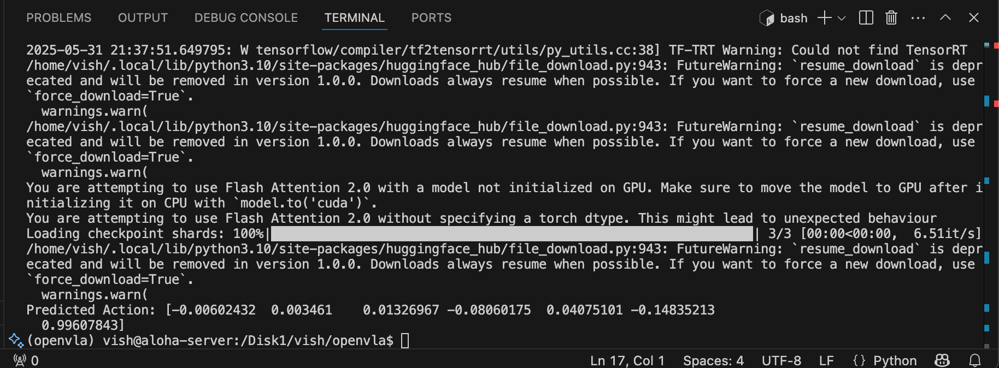

# 05 — FlashAttention: Where the Project Went Sideways

This is the part of the project I spent the most time on and got the least concrete result from. So it deserves the most honest writeup.

## Why FlashAttention mattered

OpenVLA-7B runs with vanilla scaled-dot-product attention by default. It works, just slow enough at 7B that you really want **FlashAttention 2** for any serious fine-tuning. FlashAttention's IO-aware tiling means a measurable wallclock improvement on each forward pass and a bigger one on the backward pass, where gradient checkpointing and attention combine to dominate the step time.

For inference, vanilla attention was fine. For the MiniVLA fine-tune attempt in weeks 11–12, it wasn't.

## What FlashAttention's build expects

The build needs all of these to line up:

- A specific PyTorch version compiled against a specific CUDA toolkit version
- A matching `nvcc` available on the path
- `TORCH_CUDA_ARCH_LIST` set to your GPU's compute capability (A100 is `8.0`)
- Enough RAM during the build that `MAX_JOBS` doesn't OOM the machine

The invocation that finally built cleanly:

```bash
export TORCH_CUDA_ARCH_LIST="8.0"
export MAX_JOBS=4
pip install flash-attn --no-build-isolation
```

Full script with notes is at `snippets/flashattn-build.sh`. The wheel built. `pip` reported success. `import flash_attn` worked.

## Where it broke

At inference, attention layers intermittently crashed with **symbol resolution errors against `flash_attn_2_cuda`** — the compiled CUDA extension. Sometimes a forward pass completed. Sometimes the same code crashed mid-forward with an unresolved symbol from `libtorch`.

The pattern was non-deterministic enough to rule out "broken build, retry." Build worked. Import worked. Behaviour at runtime depended on something not visible from Python.


*The two warnings that show up on every run with FlashAttention enabled: "Flash Attention 2.0 with a model not initialized on GPU" and "Flash Attention 2.0 without specifying a torch dtype." On this run inference completed and returned a valid action vector. On other runs against the same code, the same warnings preceded a crash mid-forward with a `flash_attn_2_cuda` symbol error. That's the non-determinism this doc is about.*

## Root cause, as best I could diagnose

The PyTorch wheel on the system had been built against a slightly different ABI than the one FlashAttention's CUDA extension was linking against at runtime. PyTorch C++ extensions and CUDA extensions are sensitive to:

- The exact CUDA toolkit version PyTorch was compiled with
- The exact GCC version used for the `libtorch` build
- Whether `_GLIBCXX_USE_CXX11_ABI` matched between PyTorch and the extension
- Differences in CUDA driver vs CUDA runtime versions

When FlashAttention's extension tries to call into `libtorch` symbols, a mismatch in any of these can produce "unresolved symbol" errors that only surface when the specific code path is exercised. Forward passes might happen to use symbols that resolved. Backward passes exercise more of the C++ extension API and crashed hard or silently corrupted gradients.

## What "the right fix" would have been

Rebuild PyTorch from source, on the same machine, against the exact CUDA toolkit installed there, with the same GCC, with `_GLIBCXX_USE_CXX11_ABI` matched explicitly. Then rebuild FlashAttention against that PyTorch.

That wasn't an option. Without sudo, on a shared server, with other students depending on the system-wide PyTorch, I couldn't replace the install. Building a separate user-space PyTorch from source would have taken another two weeks and risked breaking the other projects on the machine.

## What I actually did

Three things.

I documented the failure mode. Recorded which forward passes succeeded with FlashAttention enabled, which crashed, with full traces. Useful for anyone picking this up later — knowing where the boundary is means not wasting a week rediscovering it.

I ran inference with FA2 enabled where it didn't crash. Some attention layers seemed to work consistently, some didn't. Pinning the dtype helped (`torch_dtype=torch.bfloat16` on model load).

For the fine-tuning attempt I fell back to standard attention. Slower per step, but stable. The launch that ran in weeks 11–12 used standard attention. It failed for separate reasons (covered in `06-minivla-patches.md`), not FlashAttention.

## What a clean repro would have shown

A Docker container with a pinned CUDA + PyTorch + FlashAttention triple — the kind of setup that ships with most production ML infrastructure — would have avoided all of this. Lesson generalises: pin PyTorch + CUDA + FlashAttention as a single version-locked triple at the start of a project. Document exact versions. Don't let any of them drift. If your sysadmin upgrades CUDA mid-project, your FlashAttention build is dead and you may not realise until a backward pass corrupts.

This is the kind of operational discipline that's hard to internalise without getting burned once. Now I have been.

## Honest framing

Anyone telling you their FlashAttention build was clean on first try is either lying, working in a Docker container someone else maintained, or has root access. On a shared HPC server with someone else's PyTorch already installed, this is what the experience looks like. The project's biggest infrastructure failure is, paradoxically, one of its more useful contributions to anyone in the same situation.

## See also

- `snippets/flashattn-build.sh` — the build invocation
- `04-environment-setup.md` — what was already in place before this
- `06-minivla-patches.md` — what happened next, when fine-tuning launched anyway
