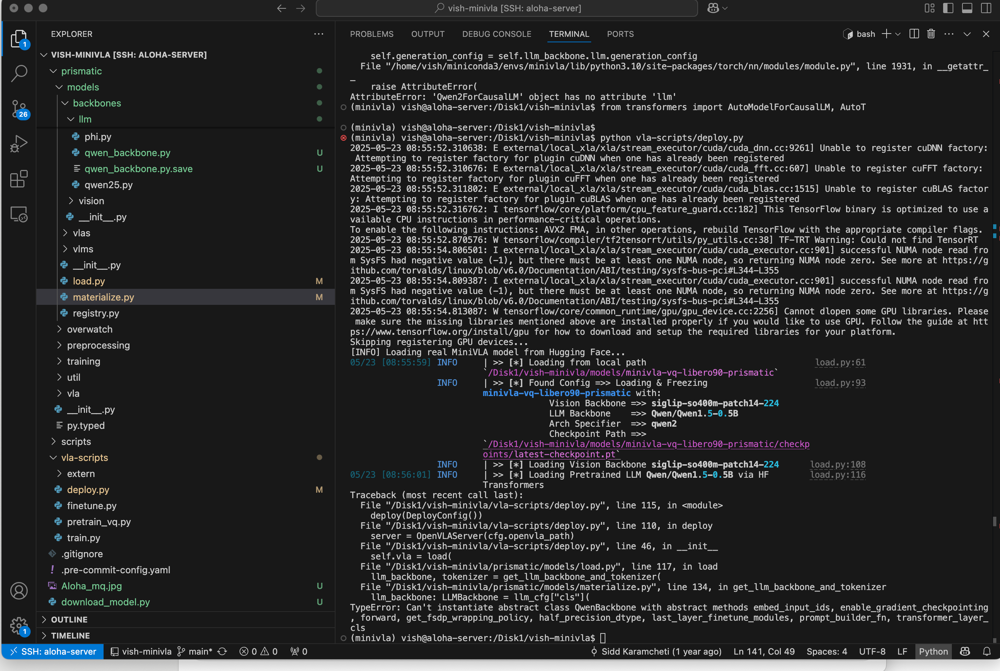
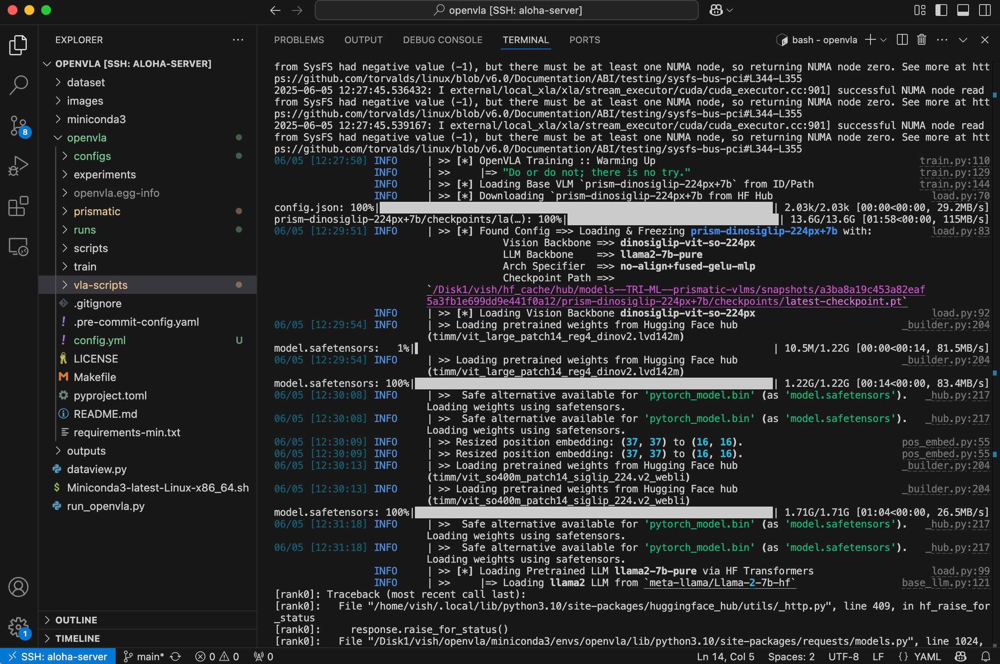

# 06 — MiniVLA Patches for the OpenVLA Training Scaffold

By week 11 the plan was to fine-tune MiniVLA, a smaller VLA built on a Qwen 2.5 0.5B language backbone, on the cleaned ALOHA dataset (`aloha_clean_dish`). MiniVLA was a more realistic target than full OpenVLA fine-tuning given the time remaining and the FlashAttention situation in `docs/05`.

The plan: use OpenVLA's training infrastructure (well-maintained, documented fine-tuning entry points, the same scaffolding MiniVLA's own authors used) with MiniVLA's smaller backbone. The architectures are related — both are Prismatic-style VLMs — so in principle this should just work.

It did not just work. Here's what had to be patched.

## The mismatch: Qwen 0.5B's hidden size

OpenVLA's training scaffolding assumes certain hidden dimensions for its projector layers — the small MLPs that map between the vision encoder's feature dimension and the language model's embedding dimension. Those assumptions are baked into the model loader and the architecture builder.

MiniVLA's Qwen 2.5 0.5B backbone has a hidden size of **896**. Non-standard. Most LLMs OpenVLA had been validated against (Llama-2-7B, Llama-3-8B) have "round" hidden sizes (4096, 5120). 896 isn't divisible by 64 or 128 the way the projector code implicitly assumed.

## Three patches

### Patch 1: `base_llm.py` — projector layer dimensions

`base_llm.py` in the Prismatic codebase contains the projector instantiation logic. It hardcodes dimension assumptions that fail silently when the backbone's hidden size doesn't match. The patch makes the projector read the actual hidden size from the loaded backbone's config rather than relying on a default.

Symptom before the patch: model loads, then the first forward pass dies in the projector with a dimension mismatch.

### Patch 2: `qwen25.py` — BOS/EOS token assertions

The Qwen 2.5 integration module includes assertions that the loaded tokenizer's BOS and EOS token IDs match expected values. Qwen 2.5 ships with a tokenizer state that doesn't match those assumptions out of the box. The assertion fires on load.

The patch relaxes the assertion: read the tokenizer's actual BOS/EOS IDs and use those throughout. Safer pattern anyway. Checkpoint-specific tokenizer state should be a source of truth, not a target to validate against.

*MiniVLA's backbone files mid-patch. The file tree on the left shows `qwen_backbone.py.save` (original) alongside the modified `qwen_backbone.py` and `qwen25.py`. The terminal shows the model successfully reaching the Qwen/Qwen1.5-0.5B load step before hitting `Can't instantiate abstract class QwenBackbone with abstract methods embed_input_ids, enable_gradient_checkpointing, forward, ...` — the error this patch addresses.*

### Patch 3: Positional embedding resize for the vision encoder

OpenVLA's Prismatic-style vision encoder uses positional embeddings sized to a specific image resolution. Default OpenVLA setup uses a vision embedding grid of **(37, 37)**. MiniVLA's smaller backbone, paired with a smaller vision context, needs **(16, 16)**.

The init code didn't interpolate between the two sizes. It errored out when the shape didn't match. The patch does bilinear interpolation of the pretrained positional embeddings from (37, 37) down to (16, 16) before they're loaded into the new architecture.

Standard technique — the original Vision Transformer paper does it for different image sizes — but you have to add it explicitly when downsizing. Not a default.

*"Resized position embedding: (37, 37) to (16, 16)" — the patch in action, twice, during training warm-up. The terminal also shows the full config being loaded: dinosiglip-vit-so-224px vision backbone, llama2-7b-pure LLM backbone, the prism-dinosiglip-224px+7b checkpoint path. This is the launch that fed straight into the FlashAttention symbol-resolution failures from docs/05.*

## Validation: load → forward → launch

With the three patches applied, the validation sequence:

1. **Load pretrained weights into the modified architecture.** No warnings about size mismatches or unexpected keys.
2. **Single-example forward pass.** Run end-to-end on one image-prompt pair without crashing.
3. **Launch the training script.** `run_openvla.py`, modified for MiniVLA, started consuming batches from `aloha_clean_dish`.

All three worked. The pipeline was structured, the dataset was prepared, the model was patched, the training loop launched.

## What killed the fine-tune

Two things.

The FlashAttention symbol issues from `docs/05` resurfaced during training. Inference had been mostly stable; training exercises more of the C++ extension surface (backward passes, gradient accumulation, optimiser steps) and intermittently corrupted gradients. With FlashAttention disabled, training was slower but stable. With it enabled, training would proceed for a while and then produce silently bad gradients.

And time. With one week left, the call was whether to chase a flaky training loop that might or might not complete a single epoch, or pivot to documenting reproducibility. Environment scripts, build instructions, the specific patches, the unresolved bugs. I documented.

The fine-tune did not finish.

## Why these patches still matter

Three of them generalise. Anyone trying to use OpenVLA's training infrastructure with a backbone other than Llama-2-7B or Llama-3-8B will hit at least one of these:

- The `base_llm.py` projector fix works for any backbone with a non-standard hidden size
- The `qwen25.py` tokenizer assertion fix is needed for any future Qwen-based VLA
- The positional embedding resize is needed any time the vision token grid changes — for example, different vision encoder, different image resolution

When (if) the source code becomes available, this doc gets updated with the actual diffs. Until then, this is the structural description.

## See also

- `02-vla-model-comparison.md` — MiniVLA's place in the landscape
- `05-flashattention-debug.md` — the FlashAttention issues that compounded this
- `08-future-work.md` — what completing the fine-tune would look like
